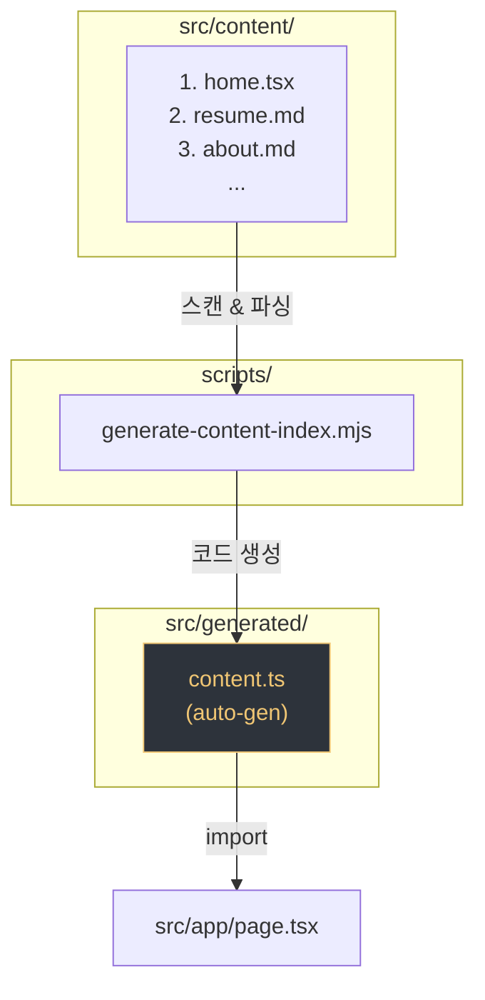

# 콘텐츠 자동 생성 파이프라인

## 개요

`src/content/` 디렉토리에 파일만 추가하면, 빌드 시 `src/generated/content.ts`가 자동 생성되어 탭이 반영됩니다. 수동으로 import를 추가하거나 탭 정의를 편집할 필요가 없습니다.

## 흐름



## 파일명 규칙

```
<번호>. <id>.<확장자>
```

| 부분 | 설명 | 예시 |
|------|------|------|
| 번호 | 탭 정렬 순서 | `1`, `2`, `99` |
| id | 탭 ID 겸 변수명 | `home`, `resume`, `portfolio1` |
| 확장자 | 콘텐츠 타입 결정 | `.md`, `.tsx` |

예시: `5. portfolio1.md` → 순서 5, id `portfolio1`, markdown 타입

## 확장자별 동작

| 확장자 | 타입 | import 형태 |
|--------|------|-------------|
| `.md` | `{ type: 'markdown', content: string }` | `import portfolio1Md from '...'` |
| `.tsx` | `{ type: 'component', component: ComponentType }` | `import Portfolio1Content from '...'` |

## 특수 탭

아래 id는 `CONTENT_TAB_DEFS` (탭 목록)에서 제외됩니다. 탭 스트립에 표시되지 않지만 `TAB_CONTENT`에는 포함되어 코드에서 직접 접근할 수 있습니다.

- `home` — 메인 홈 화면
- `settings` — 설정 페이지

## 탭 라벨

md 파일의 첫 번째 `# heading`이 탭 라벨로 사용됩니다.

```markdown
# 포트폴리오    ← 이 텍스트가 탭 라벨이 됨

본문 내용...
```

heading이 없으면 id가 그대로 라벨로 사용됩니다.

## 새 탭 추가 방법

1. `src/content/`에 파일 생성 (예: `7. blog.md`)
2. 첫 줄에 `# 블로그` 작성
3. `npm run dev` 또는 `npm run build` 실행

끝. `content.ts`가 자동 재생성되어 탭에 반영됩니다.

## 스크립트

| 명령어 | 동작 |
|--------|------|
| `npm run generate` | `content.ts` 수동 생성 |
| `npm run dev` | generate 자동 실행 → 개발 서버 |
| `npm run build` | generate 자동 실행 → 프로덕션 빌드 |

## 관련 파일

| 파일 | 역할 |
|------|------|
| `scripts/generate-content-index.mjs` | 코드 생성 스크립트 |
| `src/generated/content.ts` | 자동 생성 결과물 (수동 편집 금지) |
| `src/content/*.md`, `*.tsx` | 콘텐츠 원본 |
| `src/app/page.tsx` | `content.ts`를 import하여 렌더링 |
